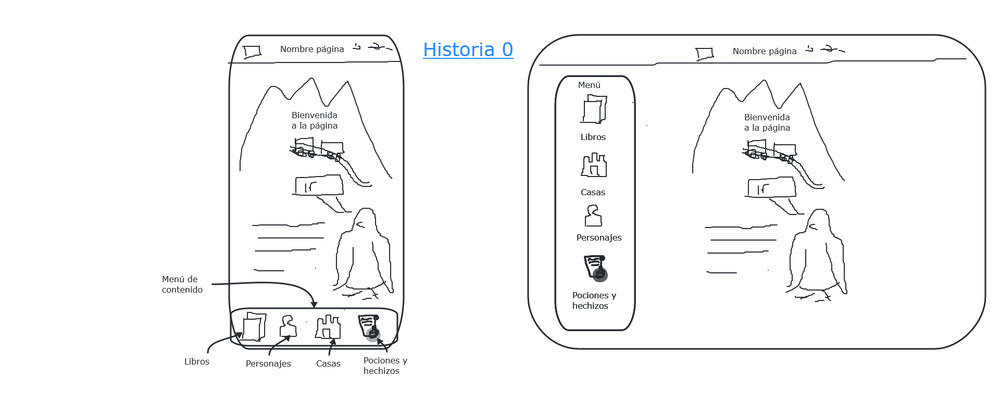
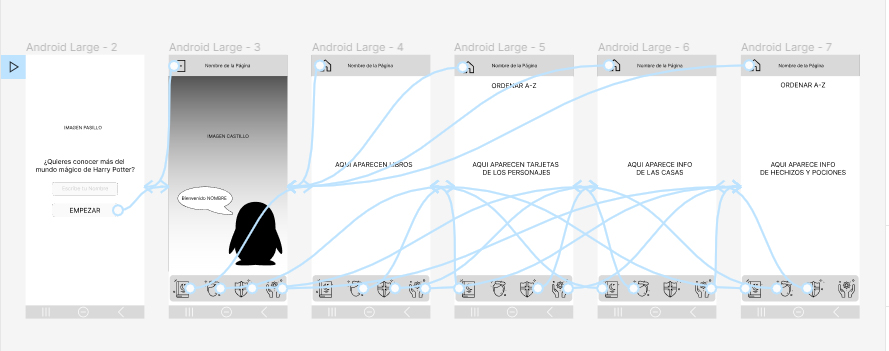
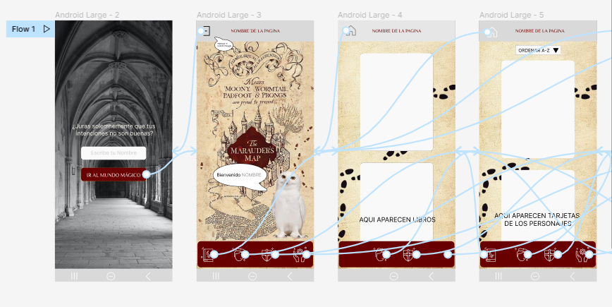
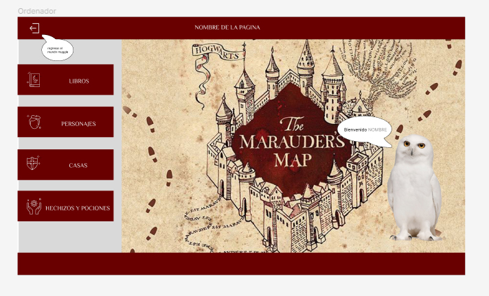
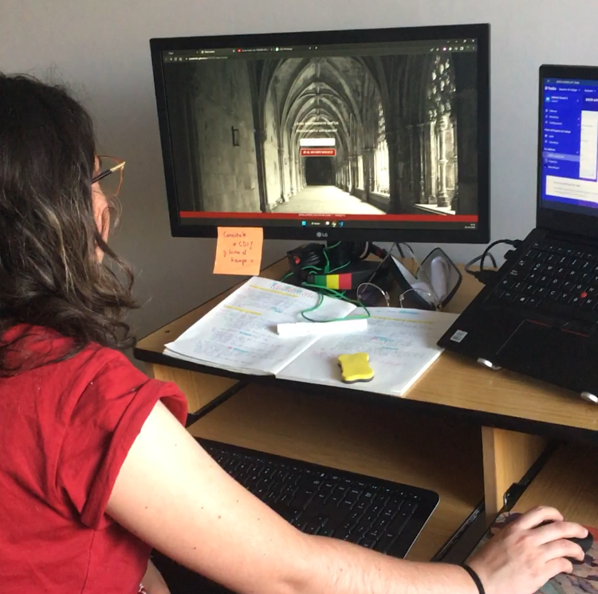
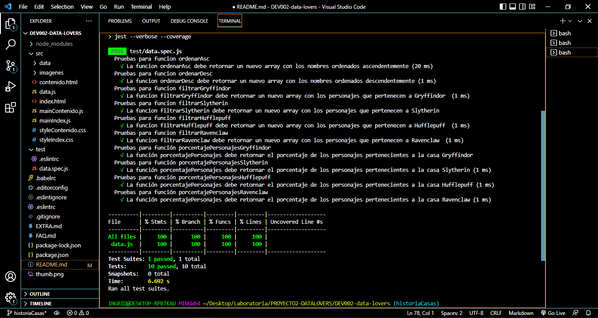

# El Mapa del Merodeador

## Índice

* [1. Preámbulo](#1-preámbulo)
* [2. Definición de Producto](#2-definición-de-producto)
* [3. Historias de usuario](#3-historias-de-usuario)
* [4. Diseño de la Interfaz de Usuario](#4-diseño-de-la-interfaz-de-usuario)

***

## 1. Preámbulo

Harry Potter es una serie de novelas fantásticas escrita por la autora británica J. K. Rowling, en la que se describen las aventuras del joven aprendiz de magia y hechicería Harry Potter y sus amigos Hermione Granger y Ron Weasley, durante los años que pasan en el Colegio Hogwarts de Magia y Hechicería. 

El Mapa del Merodeador es un curioso artículo mágico que, durante la saga, muestra las aulas, pasillos, y la mayoria de espacios y rincones del castillo del Colegio Hogwarts (excepto la Sala de los Menesteres y la cámara Secreta). Además es capaz de identificar con precisión a cada persona, y no puede ser engañado por animagos, pociones multijugos, o capas de invisibilidad. Ni siquiera los fantasmas de Hogwarts están exentos de ser localizados en el mapa. También puede revelar pasajes secretos usados por "Los Merodeadores".

## 2. Definición de Producto

El Mapa del Merodeador es una interfaz que permite a visitantes y fans de la saga convertirse en "merodeadores" para conocer información a detalle de los personajes de los libros de Harry Potter.
 
Para la construcción de la página  realizamos una lluvia de ideas y boceto inicial que nos permitio organizar y delimitar la información a mostrarse y construir las diferentes Historias de Usuario. 

Seguimos la metodología del TROZO DE PASTEL ARCOIRIS, que nos permitio desde la primera HU crear productos aptos para ser visitados y visualizar su contenido. 

* HU, Criterios de Aceptación y Definición de Terminado.
* Planificación de Tareas en Trello.
* Prototipo de Baja Fidelidad.
* Maquetado Básico HTML y CSS.
* Funcionalidad con Javascript.
* Prototipo de Alta Fidelidad.
* HTML y CSS según prototipos.
* Funcionalidad con Javascript.
* Test Unitarios.
* Testeos de Usabilidad.
* Publicación de página en Git Hub pages.

## 3. Historias de usuario - HU

Las historias de Usuario se desarrollaron en base a una pequeña investigación con fans de la saga

Se muestran los personajes de la Saga de Harry Potter

Las Tarjetas continen información relevante sobre los personajes como su nombre, fecha de nacimiento y muerte, su especie y los libros en los cuales aparece.

Se puede ordena los personajes según su nombre, en orden Ascendente y Descendente.

Permite filtrar los personajes según la Casa de Colegio a la que pertenecen: Gryffindor, Slytherin, Hufflepuff, Ravenclaw.

Se puede conocer el porcentaje de personajes que pertenecen a las casas del colegio Hogwarts.

## 4. Diseño de la Interfaz de Usuario

A continuación, se presentan imágenes con los diferentes diseños realizados durante el proceso de desarrollo del proyecto.

Cabe destacar que los primeros prototipos respondían a HU que fueron descartadas durante el proceso. Estas historias, mostraban contenido de la data referente a los hechizos y pociones. Es por este motivo que los diseños posteriores y el producto final, difieren en el contenido con estos primeros prototipos, mostrando solo data de los personajes y sus casas.

#### Prototipo de baja fidelidad

[Prototipo Baja Fidelidad](https://www.figma.com/file/jpt5p67fjWUPTB9l9twJeF/Untitled?node-id=0%3A1&t=qHBDVehVx1wSBOnf-3)

#### Prototipo de alta fidelidad

Prototipo en version Movil y Desktop

[Prototipo Alta Fidelidad](https://www.figma.com/file/jpt5p67fjWUPTB9l9twJeF/Untitled?node-id=80%3A6&t=qHBDVehVx1wSBOnf-0)

Prototipo de Tarjetas en version Movil y Desktop

[Prototipo Tarjetas](https://www.figma.com/file/jpt5p67fjWUPTB9l9twJeF/Untitled?node-id=189%3A10&t=qHBDVehVx1wSBOnf-3)

#### Testeos de usabilidad

Durante el proceso de desarrollo, se solicitó feedback del producto a distintas compañeras, además de un testeo de usabilidad a una aficionada de Harry Potter.
El testeo consistió en la usabilidad de la interfaz en dispositivo móvil y ordenador, pasando por cada unas de las secciones de la página.
Algunas de las preguntas realizadas a la usaria durante el testeo fueron las siguientes:
-"¿qué te parece la sección en rasgos generales?
-"¿es legible la información?"
-"¿agregarías, quitarías o modificarías algo de esta sección?"
-"como fan de la saga, ¿te parece un producto interesante?¿lo utilizarías por interés personal?
Junto a estas preguntas, se observó el lenguaje corporal de y las reacciones de la usaria al interactuar con la página. 

La información más relevante levantada a partir de este test y el feedback de las comañeras se resume en las siguientes ideas:
Virtudes:
1. La temática de la página es muy atractiva y la primera capa con la invitación al Mapa del Merodeador le da un aire interesante.
2. Es una experiencia entretenida que al ingresar al home aparezca Hedwig, saludando personalizadamente.
3. El diseño y la paleta de colores es acorde a la temática de la saga HP.
4. El efecto flip de las tarjetas es atractivo para la lectura.
Dificultades:
1. El diseño responsive está fallando para el dispositivo móvil, ya que los elementos se ven y pequeños y la usuaria necesita hacer zoom para leer la información.
2. Los botones para acceder a la sección de Personajes y Casas no se entienden bien, ya que se espera que al dar click a las etiquetas de los botones, el evento permita navegar, lo que no ocurre.
3. La sección de casas se espera encontrar las casas con sus nombres y distintivos, propiamente tal, sin embargo solamente se encuentran personajes filtrados por cada casa.
4. Los atributos de los personajes que no hay información, se imprimela palabra "null" en las tarjetas, lo que no se entiende para un usuario común.
5. Hay espacios vacíos que se ven poco estéticos.

Luego, con esta útil información, se procedió a la mejora de la interfaz corrigiendo las dificultades evidenciadas.

### Implementación de la Interfaz de Usuario (HTML/CSS/JS)

La interfaz tiene un diseño responsive que muestra inicialmente una página de Bienvenida. Al ingresar su nombre, el visitante podrá entrar al "Mundo Mágico"

La página principal muestra un saludo al visitante, ahora "merodeador" y, mediante los menus, puede visitar las secciones de Personajes y Casas.

### Pruebas unitarias

Pruebas Unitarias en el archivo  data.spec.js

